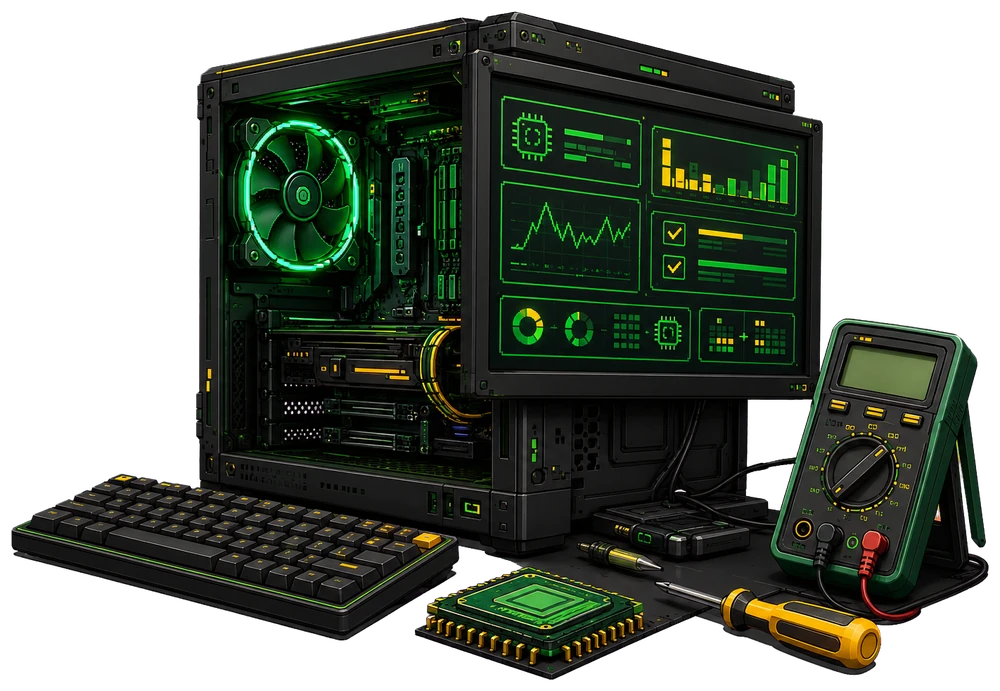

---
hide:
  - navigation
  - toc
  - path
---

<section class="sev-hero">
  

    CURSO 100% GRATUITO
    <h1>Informática para <strong>entender</strong>, investigar e resolver</h1>
    
Aprenda do básico ao diagnóstico profissional com explicações claras, situações reais e atividades práticas.

    

      <a class="sev-button sev-button--primary" href="modulo-1/aula-1-o-que-e-informatica/">Começar o curso ›</a>
      <a class="sev-button sev-button--dark" href="#modulos">Ver módulos ↓</a>
    

    <ul class="sev-hero__facts" aria-label="Diferenciais do curso">
      <li>Gratuito</li>
      <li>Prático</li>
      <li>Do básico ao avançado</li>
    </ul>
  

  

    
  

</section>

<section class="sev-modules" id="modulos">
  <header class="sev-section-heading">
    TRILHA DE APRENDIZAGEM
    <h2>Escolha por onde começar</h2>
    
Avance em uma sequência planejada ou consulte diretamente o assunto que precisa aprender.

  </header>

  

    <article class="sev-module-card sev-module-card--available">
      01
      
▣

      
11 aulas disponíveis

      <h3>Fundamentos da informática</h3>
      
Conheça os conceitos essenciais, os componentes e o funcionamento do mundo digital.

      <a href="modulo-1/aula-1-o-que-e-informatica/">Acessar módulo ›</a>
    </article>

    <article class="sev-module-card sev-module-card--available">
      02
      
⌕

      
5 aulas disponíveis

      <h3>Investigação computacional</h3>
      
Entenda sintomas, construa hipóteses e diagnostique problemas de hardware e software.

      <a href="modulo-2/aula-1-o-metodo-da-investigacao-computacional/">Acessar módulo ›</a>
    </article>

    <article class="sev-module-card sev-module-card--soon">
      03
      
⌘

      
Em desenvolvimento

      <h3>Sistemas operacionais</h3>
      
Explore Windows, Linux, ferramentas administrativas e o trabalho do sistema operacional.

      Em breve
    </article>

    <article class="sev-module-card sev-module-card--soon">
      04
      
◎

      
Em desenvolvimento

      <h3>Redes e internet</h3>
      
Descubra como dispositivos se comunicam, como a internet funciona e onde surgem os problemas.

      Em breve
    </article>
  

</section>

<section class="sev-method">
  <header class="sev-section-heading sev-section-heading--dark">
    NOSSO JEITO DE ENSINAR
    <h2>Aprenda além da teoria</h2>
    
Conhecimento técnico explicado de forma acessível, sem abrir mão da profundidade.

  </header>

  

    <article>
      💡
      <h3>Explicações técnicas</h3>
      
Conteúdo claro e direto ao ponto, com linguagem acessível.

    </article>
    <article>
      🖥️
      <h3>Situações reais</h3>
      
Casos práticos inspirados na rotina de quem trabalha com tecnologia.

    </article>
    <article>
      🛠️
      <h3>Atividades práticas</h3>
      
Exercícios e pequenos laboratórios para transformar teoria em habilidade.

    </article>
    <article>
      📦
      <h3>Dentro da caixa</h3>
      
Uma investigação especial sobre o que existe por trás de cada componente.

    </article>
  

</section>

<section class="sev-lesson-preview" aria-labelledby="aula-demonstrativa">
  <header class="sev-section-heading sev-section-heading--dark">
    VEJA COMO VOCÊ VAI APRENDER
    <h2 id="aula-demonstrativa">Uma aula por dentro</h2>
    
Conteúdo guiado, exemplos visuais e navegação clara para você sempre saber onde está e qual será o próximo passo.

  </header>

  

    <aside class="sev-lesson-sidebar" aria-label="Aulas do módulo demonstrativo">
      

        <small>MÓDULO 1</small>
        <strong>Fundamentos da informática</strong>
      

      <ol>
        <li class="is-active">1.1 Como um computador realmente funciona?</li>
        <li>1.2 Hardware: as partes físicas</li>
        <li>1.3 Software: o lado invisível</li>
        <li>1.4 Sistema de entrada e saída</li>
        <li>1.5 Armazenamento de dados</li>
      </ol>
      <a href="modulo-1/aula-1-o-que-e-informatica/">Ver módulo completo ▣</a>
    </aside>

    <article class="sev-lesson-content">
      

        Módulo 1
        <i aria-hidden="true"></i>
        <strong>Aula 1 de 11</strong>
      

      <small class="sev-lesson-content__mobile-label">MÓDULO 1 · AULA 1</small>
      <h3>Como um computador realmente funciona?</h3>
      
Todo computador segue um ciclo básico: recebe dados, processa as informações, apresenta um resultado e pode armazená-lo para uso futuro.

      

        !
        
<strong>Importante</strong> Entenda o papel de cada etapa antes de decorar nomes e especificações.

      

      <h4>O ciclo básico de funcionamento</h4>
      

        
<i aria-hidden="true">⌨</i><strong>Entrada</strong>Você fornece os dados

        <b aria-hidden="true">›</b>
        
<i aria-hidden="true">▣</i><strong>Processamento</strong>A CPU interpreta

        <b aria-hidden="true">›</b>
        
<i aria-hidden="true">▢</i><strong>Saída</strong>O resultado aparece

        <b aria-hidden="true">›</b>
        
<i aria-hidden="true">▰</i><strong>Armazenamento</strong>Os dados são salvos

      

      <nav class="sev-lesson-navigation" aria-label="Navegação da aula demonstrativa">
        ‹ Aula anterior
        <a href="modulo-1/aula-1-o-que-e-informatica/">Começar esta aula ›</a>
      </nav>
    </article>
  

</section>

<section class="sev-brand-banner">
  

    UM PROJETO EDUCACIONAL
    <h2>Smart <strong>Eletro</strong> Vini</h2>
    
Compartilhamos conhecimento técnico para transformar curiosidade em habilidade e abrir caminhos para o futuro.

  

  <a class="sev-button sev-button--primary" href="https://www.smarteletrovini.com.br/" target="_blank" rel="noopener">Conheça nossa loja ↗</a>
</section>

