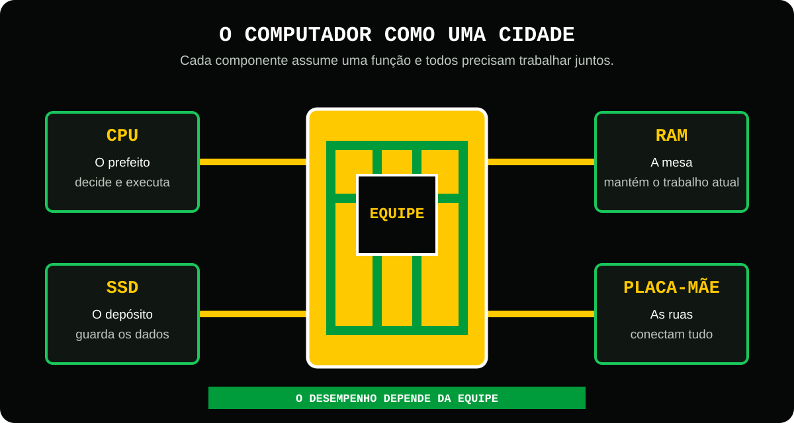
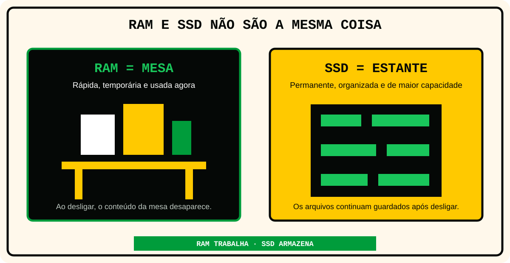
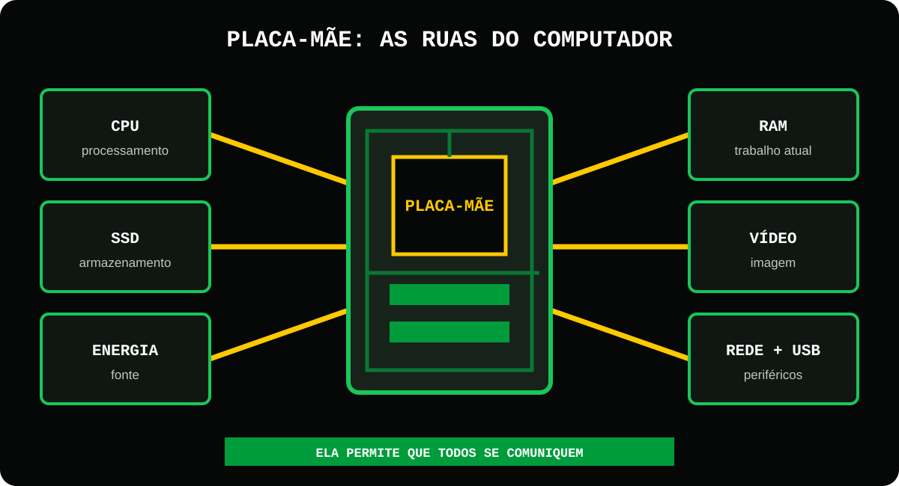
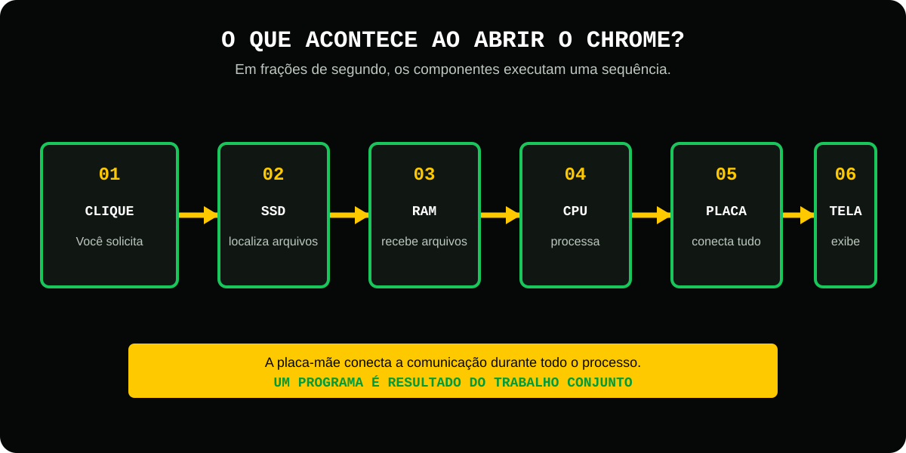

# Aula 2 - CPU, RAM, SSD e Placa-mãe

## Antes de começar
Imagine que você acabou de abrir o Instagram.

Em menos de um segundo:

- O aplicativo aparece.
- As fotos carregam.
- Os vídeos começam a tocar.
- As notificações surgem.

Tudo parece mágico.

Mas a verdade é que existem quatro componentes trabalhando juntos para que isso aconteça.

- CPU.
- Memória RAM.
- SSD.
- Placa-mãe.

Se você entender esses quatro componentes, já compreenderá a base de praticamente qualquer computador.

## O computador como uma cidade
Imagine uma cidade moderna.
Nessa cidade existem:

- Um prefeito que toma decisões.
- Ruas que conectam tudo.
- Um depósito onde ficam os materiais.
- Uma mesa de trabalho onde os materiais são usados.

Essa cidade é o seu computador.

<figure class="sev-learning-figure">
  <picture>
    <source media="(max-width: 700px)" srcset="../../assets/aulas/modulo-1/aula-2/computador-como-cidade-mobile.svg">
    
  </picture>
  <figcaption>A metáfora da cidade ajuda a separar a função de cada componente sem perder a visão do conjunto.</figcaption>
</figure>

## A CPU - O Cérebro da operação
A CPU(Processador) é o Cérebro do computador.

Ela recebe informações.

Ela toma decisões.

Ela executa instruções.

Tudo passa pela CPU.

Quando você:

- Abre o Chrome.
- Assiste um vídeo.
- Joga.
- Usa o Word.

A CPU está trabalhando.

### Curiosidade
A CPU pode realizar bilhões de operações por segundo.
Quanto mais poderosa ela for, mais tarefas consegue executar ao mesmo tempo.

## Memória RAM - A mesa de trabalho
Agora imagina um estudante.

Ele possui:

- Uma estante cheia de livros.
- Uma mesa para estudar.

A estante representa o SSD.
A mesa representa a RAM.

<figure class="sev-learning-figure">
  <picture>
    <source media="(max-width: 700px)" srcset="../../assets/aulas/modulo-1/aula-2/ram-e-ssd-mobile.svg">
    
  </picture>
  <figcaption>A RAM mantém o que está sendo usado agora; o SSD conserva programas e arquivos mesmo depois que o computador é desligado.</figcaption>
</figure>

### O que a RAM faz?
A RAM guarda temporariamente tudo aquilo que está sendo usado naquele momento.
Por exemplo:

Se você abriu: 

- WhatsApp
- Chrome
- Spotify

Esses programas são colocados na RAM.
Porque acessar a RAM é muito mais rápido do que acessar o SSD.

### O problema da mesa pequena
Imagine tentar estudar com:

- 20 livros.
- 5 cadernos.
- Um notebook.

Em uma mesa minúscula.
Fica difícil.
É exatamente isso que acontence quando falta RAM.
O computador começa a ficar lento.

### Regras simples
Mais ram significa:

- Mais programas abertos.
- Mais multitarefas.
- Menos travamentos.

## SSD - O armazém de dados
Agora imagine um enorme depósito.
Nele ficam guardados:

- Fotos.
- Vídeos.
- Jogos.
- Programas.
- Documentos.

Esse depósito é o SSD.

### O que SSD faz?
Ele guarda os dados mesmo quando o computador está desligado.
Quando você salva uma foto; Ela vai para o SSD.

Quando instala um jogo; Ele vai para o SSD.

Quando salva um docomento; Ele vai para o SSD.

## Placa-mãe - As ruas da cidade
Agora imagine uma cidade sem ruas.
O que acontece?
Nada conseguiria se conectar.
A cidade pararia.

### O que a placa-mãe faz?
Ela conecta todos os componentes.
Ela permite a comunicação entre:

- CPU
- RAM
- SSD
- Placa de vídeo
- Teclado
- Mouse
- Fonte de energia
- Rede

Tudo passa pela placa-mãe.

<figure class="sev-learning-figure">
  <picture>
    <source media="(max-width: 700px)" srcset="../../assets/aulas/modulo-1/aula-2/placa-mae-conexoes-mobile.svg">
    
  </picture>
  <figcaption>A placa-mãe cria os caminhos físicos e eletrônicos usados pelos componentes para trocar dados e receber energia.</figcaption>
</figure>

## O que acontence quando você abre um programa?
Vamos seguir o caminho:

### Passo 1
Você clica no Chrome.

### Passo 2
O Chrome está armazenado no SSD.

### Passo 3
Os arquivos são enviados para a RAM.

### Passo 4
A CPU processa as informações.

### Passo 5
A placa-mãe conecta toda a comunicação.

### Passo 6
O programa aparece na tela.

<figure class="sev-learning-figure">
  <picture>
    <source media="(max-width: 700px)" srcset="../../assets/aulas/modulo-1/aula-2/abrindo-um-programa-mobile.svg">
    
  </picture>
  <figcaption>A abertura de um programa é rápida porque os componentes dividem o trabalho e se comunicam em uma sequência coordenada.</figcaption>
</figure>

Tudo isso acontence em frações de segundos.

## A grande lição
Um computador é uma equipe.

Não adianta ter apenas um componente excelente.
Todos precisam trabalhar juntos.

- CPU.
- RAM.
- SSD.
- Placa-mãe

## Resumo da aula
CPU = Cérebro do computador.
RAM = Área temporária de trabalho.
SSD = Armazenamento permanente.
Placa-mãe = Conexão entre os componentes.
O desempenho depende do trabalho conjunto desses elementos.
Todo programa executado passa por CPU, SSD, RAM e Placa-mãe.
