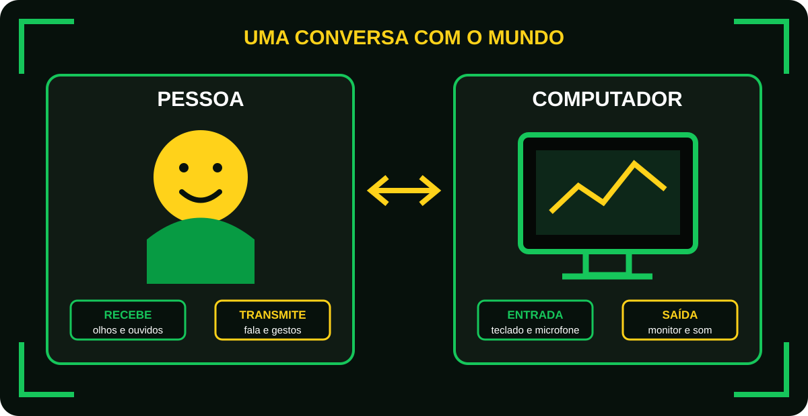
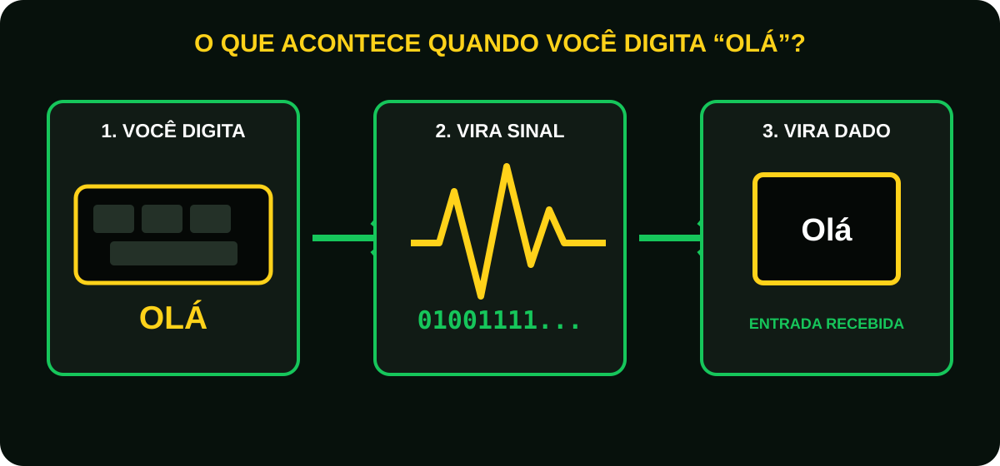
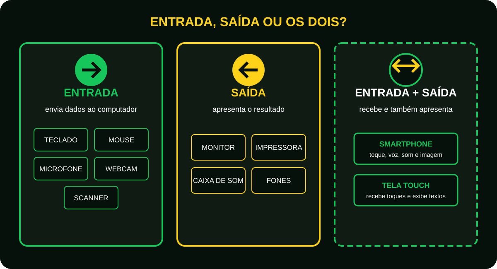
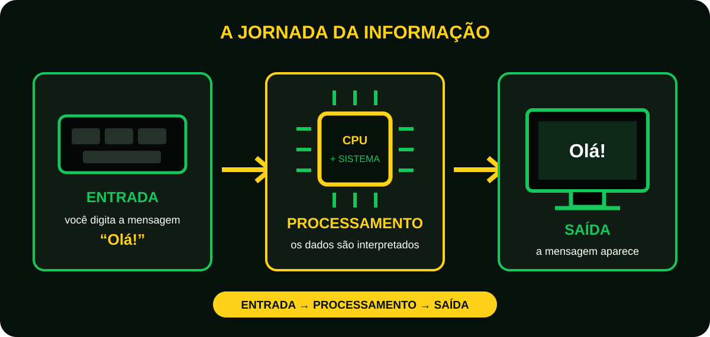

# Aula 3 - Dispositivos de entrada e saída

## Antes de começar
Imagine que você está conversando com um amigo.
Durante a conversa você:

- Escuta.
- Observa.
- Fala.
- Escreve.

Ou seja, você recebe informações e transmite informações.

Ele também precisa:

- Receber informações.
- Processar informações.
- Enviar informações.

Mas como ele faz isso?

Através dos dispositivos de entrada e saída.

## O computador é como uma pessoa
Imagine o corpo humano.

Para receber informações usamos:

- Olhos.
- Ouvidos.
- Nariz.
- Pele.

Para transmitir informações usamos:

- Boca.
- Mãos.
- Gestos.

O computador funciona de maneira semelhante.
Ele possui dispositivos para receber informações e dispositivos para apresentar resultados.

<figure class="sev-learning-figure">
  <picture>
    <source media="(max-width: 700px)" srcset="../../assets/aulas/modulo-1/aula-3/pessoa-e-computador-mobile.svg">
    
  </picture>
  <figcaption>Assim como uma pessoa, o computador precisa de meios para receber e transmitir informações.</figcaption>
</figure>

## O que são dispositivos de entrada?
**São equipamentos que enviam informações para o computador.**
Em outras palavaras.
"Eles permitem que o usuário converse com o computador."

### Exemplo simples
Quando você digita: "Olá" no teclado. O computador não entende letras.
Ele recebe sinais eletrônicos.

O teclado envia esses sinais para o sistema.
Isso é uma entrada de dados.

<figure class="sev-learning-figure">
  <picture>
    <source media="(max-width: 700px)" srcset="../../assets/aulas/modulo-1/aula-3/teclado-para-dados-mobile.svg">
    
  </picture>
  <figcaption>O teclado transforma a ação física de digitar em sinais que o computador consegue receber.</figcaption>
</figure>

### Principais dispositivos de entrada

#### Teclado
Permite inserir:

- Letras.
- Números.
- Comandos.

É um dos dispositivos de entrada mais utilizados do mundo.

#### Mouse
Permite: 

- Mover o cursor.
- Selecionar itens.
- Clicar em comandos.

O mouse envia constantemente sua posição para o computador.

#### Microfone
Transforma sons em dados digitais. Quando você grava um áudio no WhatsApp, o microfone está enviando informações ao computador ou celular.

#### Webcam
Captura imagens e vídeos.
Transforma tudo em dados digitais.

#### Scanner
Converte documentos físicos em arquivos digitais.

#### Leitor Biométrico
Captura:

- Impressão digital.
- Reconhecimento facial.
- Outras características biométricas.

## O que são dispositivos de saída?
São equipamentos que recebem informações do computador.

Em outras palavras:
**"Eles mostram ao usuário o resultado do processamento."**

Exemplos simples:

Você digita "Olá", o computador processa. Depois exibe o texto na tela.
A tela está realizando uma saída de dados.

### Principais dispositivos de saída

#### Monitor
Apresenta:

- Textos.
- Imagens.
- Vídeos.

É o principal dispositivo de saída.

#### Impressora
Transforma informações digitais em papel.

#### Caixa de som
Converte dados digitais em áudio

#### Headset e fones de ouvido
Também reproduzem sons.
São dispositivos de saída.

### E os dispositivos de entrada e saída

#### Smartphone
Recebe:

- Toques.
- Voz.
- Imagens. 

Envia:

- Som.
- Vídeo.
- Vibrações.

#### Tela touch screen
Recebe:

- Toques.

Exibe:

- Textos.

<figure class="sev-learning-figure">
  <picture>
    <source media="(max-width: 700px)" srcset="../../assets/aulas/modulo-1/aula-3/entrada-saida-ambos-mobile.svg">
    
  </picture>
  <figcaption>Observe o sentido da informação: ela entra no computador, sai dele ou faz os dois caminhos.</figcaption>
</figure>

## A jornada da informação
Imagine o seguinte:
Você envia uma mensagem no WhatsApp.

**Entrada**; Você digita no teclado.

**Processamento**; CPU e sistemas processam.

**Saída**; A mensagem aparece na tela.

Percebe? Praticamente tudo na informática segue esse ciclo.

**O ciclo mais importante da computação**

```text
ENTRADA -> PROCESSAMENTO -> SAÍDA
```

<figure class="sev-learning-figure">
  <picture>
    <source media="(max-width: 700px)" srcset="../../assets/aulas/modulo-1/aula-3/ciclo-entrada-processamento-saida-mobile.svg">
    
  </picture>
  <figcaption>Uma ação simples percorre as três etapas fundamentais da computação.</figcaption>
</figure>

## Curiosidade
Os primeiros computadores utilizavam cartões perfurados para a entrada de dados.

Os usuários precisavam literalmente fazer furos em cartões para informar comandos ao sistema.
Hoje fazemos a mesma tarefa com um toque na tela.
