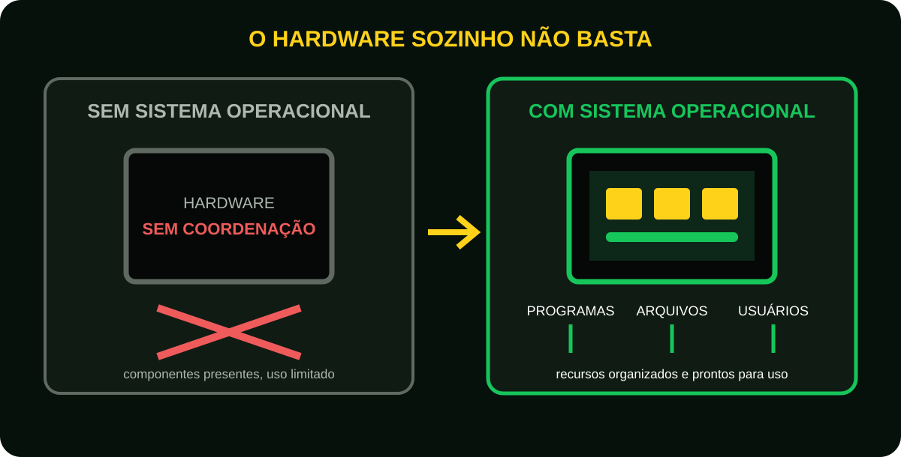
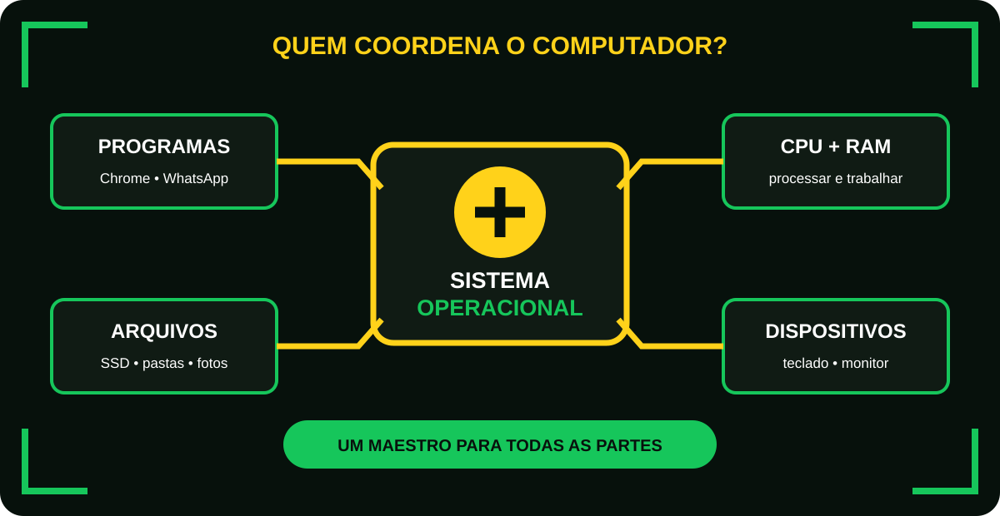
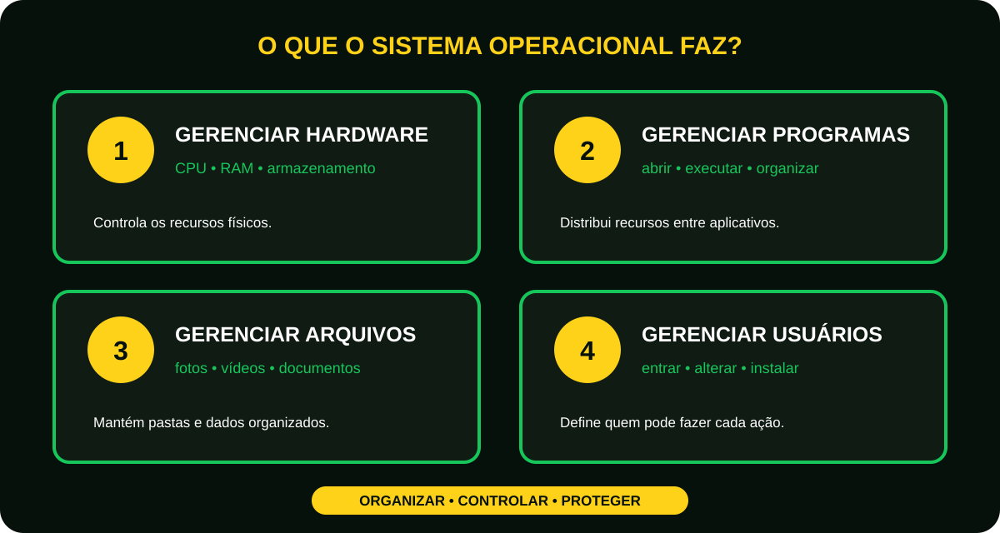
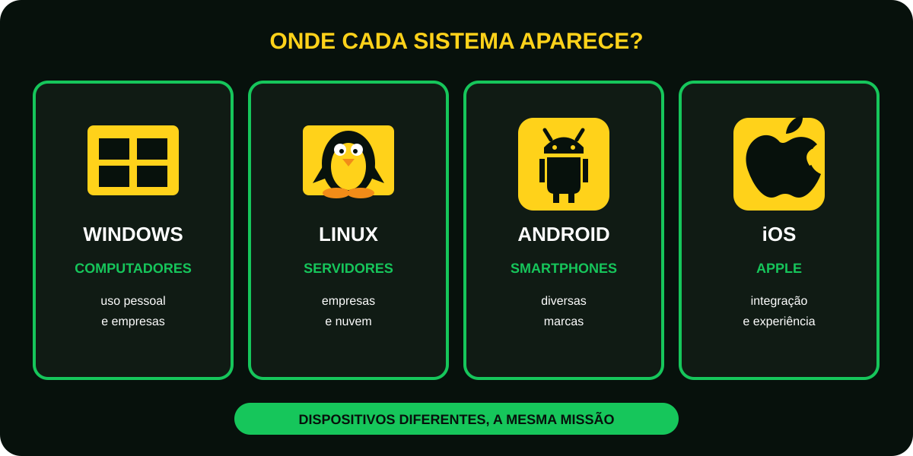

# Aula 4 - Sistemas operacionais: O maestro do computador

Porque agora surge uma pergunta natural:

**“Se CPU, RAM, SSD e dispositivos existem, quem coordena tudo isso?”**
A resposta é:

O sistema operacional

Imagine comprar um computador novinho.  
Você liga, a tela acende.  

Os componentes estão todos lá:

- Processador
- Memória RAM
- SSD
- Placa-mãe

Mas existe um problema.  
O computador não possui sistema operacional.  
O que acontece?  
Praticamente nada.  
É como comprar um carro sem motorista.  
O motor existe, as rodas estão lá o tanque está cheio. Mas ninguém está controlando o veículo.  

<figure class="sev-learning-figure">
  <picture>
    <source media="(max-width: 700px)" srcset="../../assets/aulas/modulo-1/aula-4/sem-e-com-sistema-mobile.svg">
    
  </picture>
  <figcaption>O hardware fornece os recursos; o sistema operacional transforma esses recursos em um computador utilizável.</figcaption>
</figure>

## A analogia do maestro.  
Imagine uma orquestra.  
Temos:
- Violino
- Piano
- Trompete
- Bateria
Todos são excelentes músicos. Mas sem um maestro?  
Provavelmente teremos confusão.  
Cada um tocará em um ritmo diferente.  

O sistema operacional é o maestro do computador.

Ele coordena:

- CPU
- RAM
- SSD
- Teclado
- Mouse
- Monitor
- Impressora

<figure class="sev-learning-figure">
  <picture>
    <source media="(max-width: 700px)" srcset="../../assets/aulas/modulo-1/aula-4/sistema-operacional-maestro-mobile.svg">
    
  </picture>
  <figcaption>Como um maestro, o sistema operacional mantém programas e componentes trabalhando de forma coordenada.</figcaption>
</figure>

O que o sistema operacional faz?  
ele é responsável por:  

## Gerenciar o hardware

Controle:

- Processador
- Memória 
- Armazenamento

## Gerenciar programas

Quando você abre:

- Chrome 
- WhatsApp
- Spotify

O sistema operacional organiza tudo.

## Gerenciar arquivos
Fotos, vídeos, documentos, pastas. Tudo passa por ele.

## Gerenciar Usuários
Quem pode:

- Entrar 
- Alterar arquivos 
- Instalar programas

<figure class="sev-learning-figure">
  <picture>
    <source media="(max-width: 700px)" srcset="../../assets/aulas/modulo-1/aula-4/quatro-funcoes-mobile.svg">
    
  </picture>
  <figcaption>Gerenciar significa organizar, controlar e proteger os recursos disponíveis.</figcaption>
</figure>

## O computador sem sistema operacional

Imagine que você entra em uma biblioteca.  
Existem milhares de livros.    
Mas:

- Sem catálogo
- Sem organização 
- Sem biblioteca 

Você levaria horas para encontrar qualquer coisa.  
O sistema operacional organiza toda a “biblioteca” do computador.  

## Os sistemas operacionais mais conhecidos
### Windows 
Mais popular em computadores pessoais.  
Pontos fortes:

- Facilidade de uso 
- Compatibilidade 

### Linux 
Muito usado em:

- Servidores
- Empresas
- Nuvem

Pontos fortes:

- Estabilidade 
- Segurança
- Flexibilidade

### Android 
Presente em bilhões de smartphones.  
Baseado em Linux.  

### iOS
Foco em integrações e experiência do usuário.  

<figure class="sev-learning-figure">
  <picture>
    <source media="(max-width: 700px)" srcset="../../assets/aulas/modulo-1/aula-4/mapa-sistemas-mobile.svg">
    
  </picture>
  <figcaption>Sistemas diferentes aparecem em ambientes diferentes, mas todos coordenam os recursos do dispositivo.</figcaption>
</figure>

## Curiosidade
Grande parte da internet funciona em servidores Linux.  
Quando você acessa:

- Sites.
- Streaming.
- E-commerce.

Existe uma enorme chance de haver um servidor Linux trabalhando nos bastidores.
