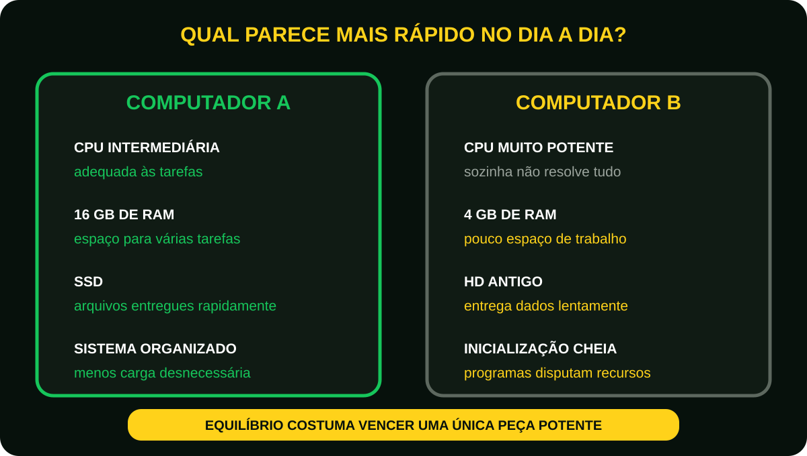

# Aula 6 - Por que um computador fica lento?
Imagine duas pessoas.  
A primeira precisa organizar 100 documentos sobre uma mesa enorme.  
A segunda precisa organizar os mesmos 100 documentos, mas em uma mesa muito pequena e cheia de objetos.  
Quem termina primeiro?   
Provavelmente a primeira pessoa.  

Agora imagine que, além da mesa pequena, ela também precise buscar os documentos em um depósito distante toda vez que precisar deles.  
O trabalho ficará ainda mais demorado.   
É exatamente isso que acontece com um computador.  
**Quando falta espaço, organização ou velocidade, o desempenho diminui.**  

## O mito do “processador fraco”
Muitas pessoas acreditam que um computador lento sempre possui um processador ruim.  
Isso nem sempre é verdade.  

O desempenho depende da combinação entre vários componentes.  
Pense em uma equipe de futebol.  
ter apenas um excelente atacante não garante vitória.  
É preciso que todos trabalhem juntos.  
No computador acontece a mesma coisa.  

<figure class="sev-learning-figure">
  <picture>
    <source media="(max-width: 700px)" srcset="../../assets/aulas/modulo-1/aula-6/equilibrio-do-desempenho-mobile.svg">
    
  </picture>
  <figcaption>O desempenho é resultado do conjunto: um único componente no limite pode atrasar toda a tarefa.</figcaption>
</figure>

## Os quatro grandes responsáveis pelo desempenho

### CPU 
A CPU executa cálculos e processa instruções.  
Se muitos programas exigem processamento ao mesmo tempo, ela pode atingir seu limite.  
Sinais comuns:

 - Lentidão ao abrir programas pesados;
 - Travamentos durante os jogos;
 - Demora para editar vídeos.

### Memória RAM
A RAM funciona como a mesa de trabalho.  
Quando ela fica cheia, o computador precisa utilizar o armazenamento como apoio.  
Esse processo é muito mais lento. 

 - Muitas abas abertas deixam o computador lento;
 - Programas fecham inesperadamente;
 - O sistema demora para alternar entre aplicativos.

<figure class="sev-learning-figure">
  <picture>
    <source media="(max-width: 700px)" srcset="../../assets/aulas/modulo-1/aula-6/quando-a-ram-enche-mobile.svg">
    
  </picture>
  <figcaption>Quando a RAM fica cheia, o sistema recorre ao armazenamento como apoio; a tarefa continua, porém com menor velocidade.</figcaption>
</figure>

### SSD ou HD
Imagine procurar um livro em uma biblioteca organizada, você encontra rapidamente.  
Em um depósito bagunçado, demora muito mais.  
o SSD encontra e entrega dados com muito mais rapidez do que um HD tradicional.  
Por isso, substituir um HD por um SSD costuma ser uma das melhorias mais perceptíveis para o usuário.  

### Sistema operacional
Mesmo com bom hardware, um sistema mal configurado pode prejudicar o desempenho.  
Exemplos:

 - Muitos programas iniciando automaticamente;
 - Atualizações interrompidas;
 - Poucos espaço livre em disco;
 - Arquivos temporários acumulados;

### Exemplo do mundo real
Imagine dois computadores. 

#### Computador A

- CPU intermediária;
- 16 GB de RAM;
- SSD;
- Sistema organizado.

#### Computador B

- CPU muito potente;
- 4Gb de RAM;
- HD antigo;
- Sistema cheio de programas iniciando automaticamente.

Qual será mais agradável de usar no dia a dia?  
Em muitas tarefas, o computador A oferecerá uma experiência melhor.  
Isso mostra que o desempenho é resultado do equilíbrio entre os componentes.  

<figure class="sev-learning-figure">
  <picture>
    <source media="(max-width: 700px)" srcset="../../assets/aulas/modulo-1/aula-6/computador-a-versus-b-mobile.svg">
    
  </picture>
  <figcaption>Uma CPU potente não compensa sozinha pouca memória, armazenamento lento e excesso de programas.</figcaption>
</figure>

## O que você pode fazer para melhorar o desempenho?
Antes de comprar um computador novo, pergunte:

- Há espaço suficiente no armazenamento?
- O computador utiliza SSD?
- Existe memória RAM suficiente?
- Muitos programas iniciam junto com o sistema?
- O sistema operacional está atualizado?

Muitas vezes, uma simples atualização de SSD ou memória RAM resolve o problema.

<figure class="sev-learning-figure">
  <picture>
    <source media="(max-width: 700px)" srcset="../../assets/aulas/modulo-1/aula-6/diagnostico-da-lentidao-mobile.svg">
    
  </picture>
  <figcaption>Investigue primeiro; a causa encontrada indica se basta organizar o sistema ou se um upgrade realmente é necessário.</figcaption>
</figure>

## Curiosidade
**Muitas pessoas compram um computador novo acreditando que o antigo “não presta”.** 

Na prática, diversos computadores recuperam grande parte do desempenho apenas com:

- Instalação de um SSD;
- Aumento da memória RAM;
- Limpeza do sistema;
- Atualização de drivers e do sistema operacional.
