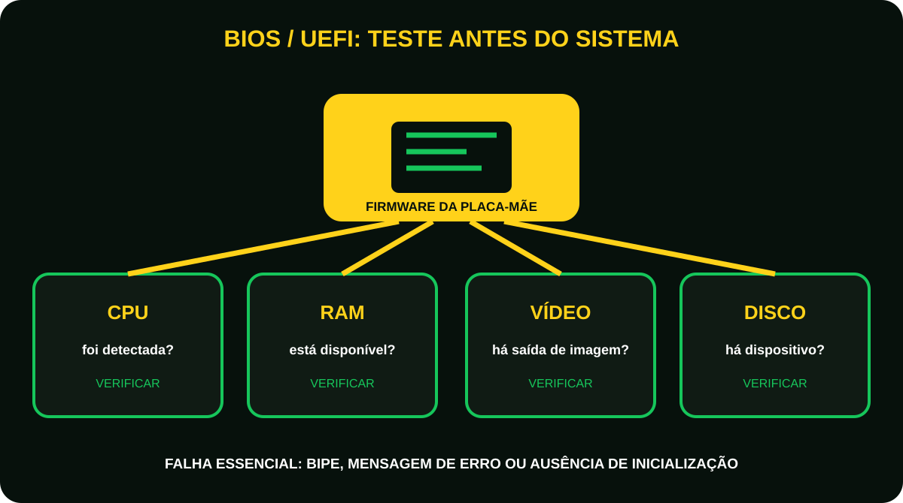
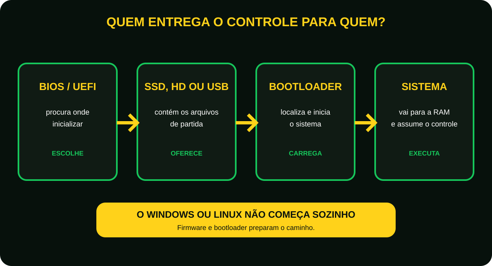

# Aula 7 - O que acontece quando você liga um computador?
Faça um teste.  
Quando você aperta o botão de ligar do computador…  
O que acontece?  
A maioria das pessoas responde:  
“O Windows liga.”  

Mas essa resposta está incompleta.  
Na verdade, antes mesmo do Windows aparecer, várias etapas acontecem em poucos segundos.  
Hoje você descobrirá essa sequência.  

<figure class="sev-learning-figure">
  <picture>
    <source media="(max-width: 700px)" srcset="../../assets/aulas/modulo-1/aula-7/sequencia-da-inicializacao-mobile.svg">
    
  </picture>
  <figcaption>O sistema operacional aparece no final de uma sequência que começa com energia e verificação do hardware.</figcaption>
</figure>

## Imagine um teatro
Pense em um grande teatro.  
Antes da peça começar:  

- As luzes são acesas;
- Os equipamentos são testados;
- Os atores ocupam suas posições; 
- O diretor verifica se está tudo pronto.

Somente depois a cortina se abre.  
Com o computador acontece exatamente a mesma coisa.  
O sistema operacional é o espetáculo.  
Antes dele começar, existe toda uma preparação.  

## Energia
Quando você aperta o botão de ligar: A fonte de alimentação distribui energia para todos os componentes.  
Neste momento recebem energia:

- Placa-mãe;
- Processador;
- Memória RAM;
- SSD;
- Placa de vídeo;
- Demais dispositivos.

**Sem energia, nada funciona.**

## BIOS ou UEFI
Agora entra em ação um pequeno programa gravado na placa-mãe.  
**Ele é chamado de BIOS ou UEFI.**  
Sua missão é verificar se os componentes principais estão funcionando.  
Ela faz perguntas como:

- Existe memória RAM?
- Existe processador?
- Existe armazenamento?
- Existe teclado?
- Existe placa de vídeo?

Se algum componente essencial apresentar falhas, o computador pode emitir bipes, exibir mensagens de erro ou nem iniciar.  

<figure class="sev-learning-figure">
  <picture>
    <source media="(max-width: 700px)" srcset="../../assets/aulas/modulo-1/aula-7/post-bios-uefi-mobile.svg">
    
  </picture>
  <figcaption>O teste inicial confirma se os componentes essenciais estão presentes e respondendo.</figcaption>
</figure>

## Curiosidade
A BIOS é um tipo de firmware: um software gravado diretamente em um chip da placa-mãe.  
Por isso, ela continua disponível mesmo quando o computador está desligado.  

## Procurando o sistema operacional
Depois da verificação, a BIOS/UEFI procura um dispositivo inicializável.
Pode ser:

- SSD;
- HD;
- Pen drive;
- DVD nem sei se existe ainda.

Quando encontra um dispositivo válido, ela entrega o controle para o carregador de inicialização (bootloader), responsável por iniciar o sistema operacional.

<figure class="sev-learning-figure">
  <picture>
    <source media="(max-width: 700px)" srcset="../../assets/aulas/modulo-1/aula-7/passagem-de-controle-mobile.svg">
    
  </picture>
  <figcaption>Firmware, dispositivo de inicialização e bootloader preparam o caminho para o sistema assumir o controle.</figcaption>
</figure>

## Carregando o sistema operacional
Agora o Windows, Linux ou outros sistemas operacionais começam a ser carregados na memória RAM.  
Nesse momento:

- Drivers são carregados;
- Serviços são iniciados;
- Arquivos importantes são preparados;
- O ambiente do sistema operacional é montado. 

Tudo isso acontece antes mesmo de você visualizar a Área de trabalho.  

## Login
Finalmente aparece a tela de login.  
Após informar sua senha ou utilizar outro método de autenticação, o sistema:

- Carrega suas informações;
- Abre os programas configurados para iniciar automaticamente;
- Exibe a área de trabalho.

Agora o computador está pronto para o uso.

## O que pode impedir a inicialização?
Alguns exemplos:

- Memória RAM mal encaixada;
- SSD com defeito;
- Sistema operacional corrompido;
- Configuração incorreta da BIOS/UEFI;
- Fonte de alimentação com problemas(acontece bastante com fonte de qualidades ruins).

Perceba como conhecer a sequência de inicialização ajuda no diagnóstico.

<figure class="sev-learning-figure">
  <picture>
    <source media="(max-width: 700px)" srcset="../../assets/aulas/modulo-1/aula-7/mapa-de-falhas-no-boot-mobile.svg">
    
  </picture>
  <figcaption>Observar em qual etapa a inicialização parou ajuda a reduzir hipóteses antes de testar componentes.</figcaption>
</figure>

## Curiosidade
Você já percebeu que alguns computadores exibem o logotipo do fabricante antes do Windows?  
Esse logotipo é exibido pela BIOS/UEFI, antes do sistema operacional assumir o controle.
