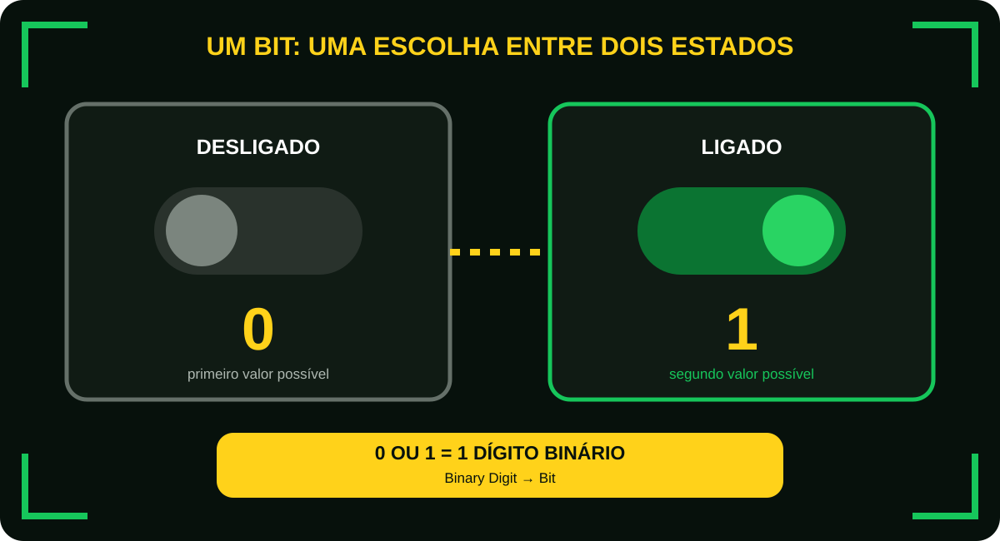
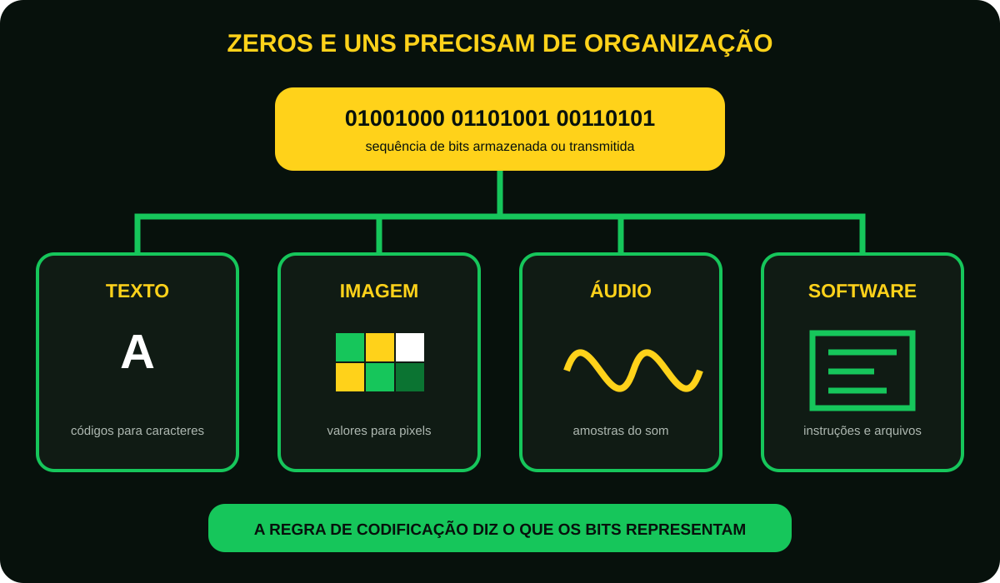
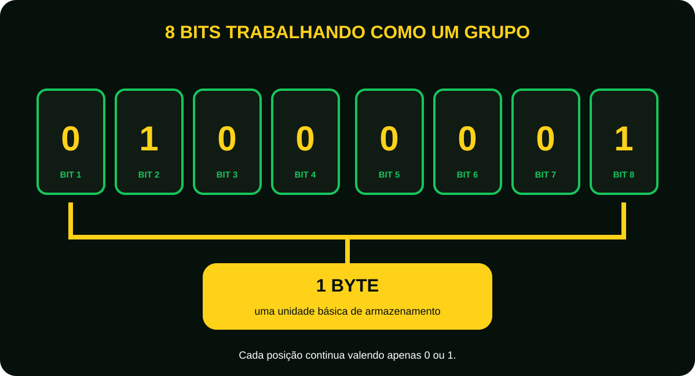
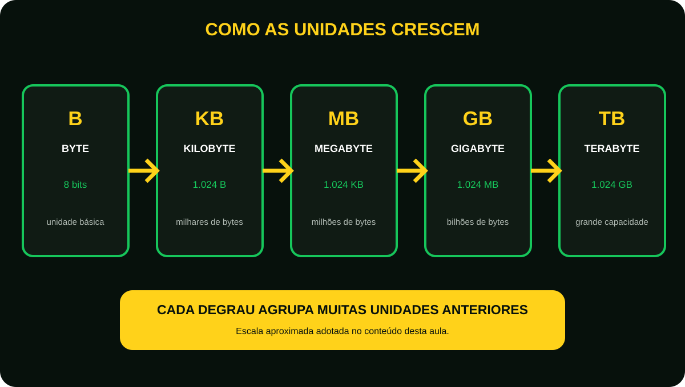
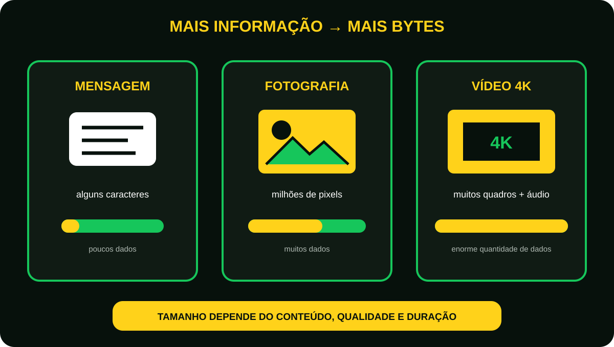

# Aula 8 - Como o computador entende as informações? (Bits, Bytes e dados)

Imagine que alguém faça uma pergunta para você.  
A resposta só pode ser: Sim ou Não   
Nada mais.  
Agora imagine responder qualquer pergunta do mundo utilizando apenas SIM e Não.  
Parece impossível.  
Mas é exatamente assim que o computador funciona.  

## O idioma dos computadores 
Nós falamos:

- Português;
- Inglês;
- Espanhol.

O computador possui apenas um idioma.  
Esse idioma chama-se...

### Linguagem Binária
Ela possui somente dois valores.  
**0** e **1** 
Nada além disso.  

### O que é um Bit?
Bit significa:
**Binary Digit (Dígito Binário).**  
Um bit pode assumir apenas dois valores.  
```c
 0 || 1
```
Imagine um interruptor.  
Ligado ou Desligado, não existe meio termo. Da mesma forma Bit = 0 ou 1.  

<figure class="sev-learning-figure">
  <picture>
    <source media="(max-width: 700px)" srcset="../../assets/aulas/modulo-1/aula-8/dois-estados-um-bit-mobile.svg">
    
  </picture>
  <figcaption>Um bit registra uma escolha entre dois valores possíveis: 0 ou 1.</figcaption>
</figure>

### Então como surge uma foto?
Pense em um quebra-cabeça.  
Cada peça isolada possui pouco significado.   
Mas milhares de peças juntas formam uma imagem.  
Com o computador acontece a mesma coisa.  
Um único bit diz quase nada.  
Milhões de bits formam:  

- Fotos;
- Vídeos; 
- Jogos;
- Documentos;
- Músicos;
- Sistemas operacionais. 

Tudo é formado por bilhões de pequenos 0 e 1.  

<figure class="sev-learning-figure">
  <picture>
    <source media="(max-width: 700px)" srcset="../../assets/aulas/modulo-1/aula-8/bits-representam-dados-mobile.svg">
    
  </picture>
  <figcaption>Zeros e uns ganham significado quando uma regra de codificação define como eles devem ser interpretados.</figcaption>
</figure>

## O que é um byte?
Agora imagine uma palavra.  
Uma única letra diz pouca coisa.  
Mas várias letras juntas formam palavras.  
Com os bits acontece o mesmo.  
8 bits juntos formam:
**1 Byte**   
**O byte é a unidade básica utilizada para armazenar informações.**

<figure class="sev-learning-figure">
  <picture>
    <source media="(max-width: 700px)" srcset="../../assets/aulas/modulo-1/aula-8/oito-bits-um-byte-mobile.svg">
    
  </picture>
  <figcaption>Cada posição continua aceitando somente 0 ou 1; o agrupamento de oito posições forma um byte.</figcaption>
</figure>

## Como crescem os arquivos?

**À medida que os dados aumentam, usamos unidades maiores.**

|**Unidade**|**Equivale aproximadamente a**|
|-------|--------------------------|
|Byte(B)|8 Bits|
|Kilobyte (KB)|1.024 Bytes|
|Megabyte (MB)|1.024 KB|
|Gigabyte (GB)|1.024 MB|
|Terabyte (TB)|1.024 GB|

<figure class="sev-learning-figure">
  <picture>
    <source media="(max-width: 700px)" srcset="../../assets/aulas/modulo-1/aula-8/escala-das-unidades-mobile.svg">
    
  </picture>
  <figcaption>Usamos unidades maiores para evitar expressar arquivos e dispositivos como quantidades enormes de bytes.</figcaption>
</figure>

## Exemplo do mundo real
Imagine três arquivos.  
Um documento de texto.  
Uma fotografia.  
Um filme em alta definição.  
Qual ocupa mais espaço?  

O filme.  
Por quê?  

Porque contém muito mais informações.  
Quanto mais informações, mais bytes.  
Quanto mais bytes, maior será o arquivo.  

### O celular também trabalha assim
Quando você tira uma foto.  
Ela não é armazenada como “uma foto”.  
Ela é armazenada como milhões de dados.  
Quando você grava um vídeo, O mesmo acontece. 
Quando você envia um áudio, também.
Para o computador, tudo são dados.

<figure class="sev-learning-figure">
  <picture>
    <source media="(max-width: 700px)" srcset="../../assets/aulas/modulo-1/aula-8/quantidade-de-dados-mobile.svg">
    
  </picture>
  <figcaption>O tamanho real varia, mas conteúdo, qualidade e duração ajudam a explicar por que alguns arquivos exigem muito mais bytes.</figcaption>
</figure>

## Curiosidade 
Um filme em qualidade 4k pode ocupar dezenas de Gigabytes.  
Já uma simples mensagem de texto ocupa apenas alguns Bytes.  
A diferença está na quantidade de informações armazenadas.
