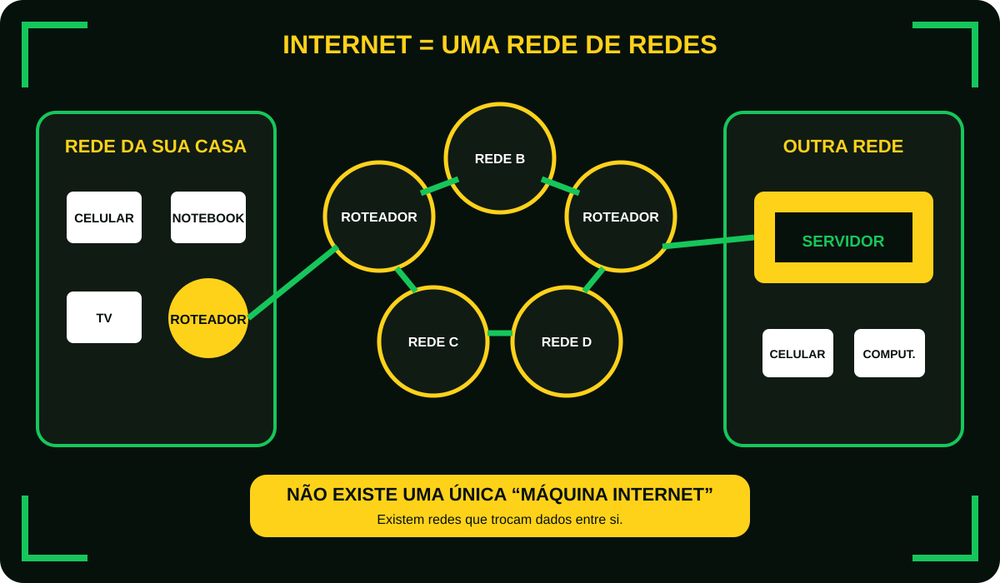
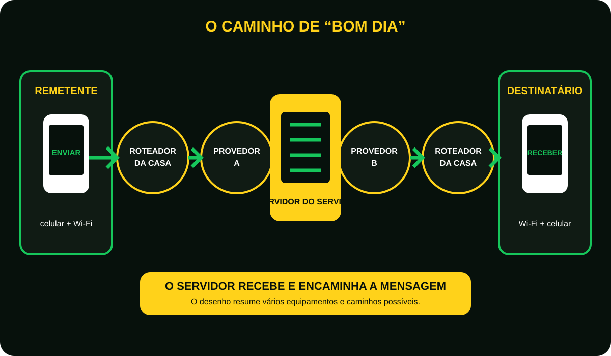
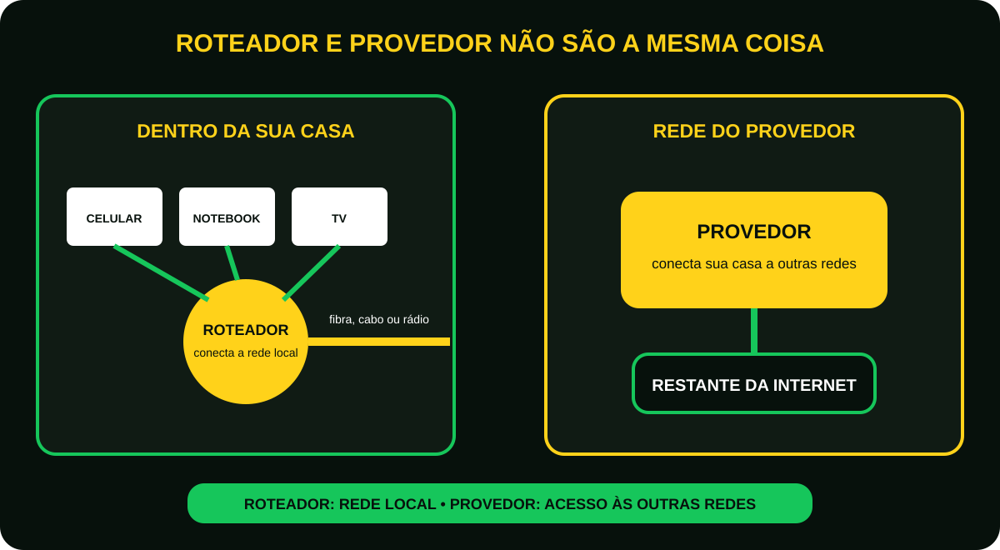
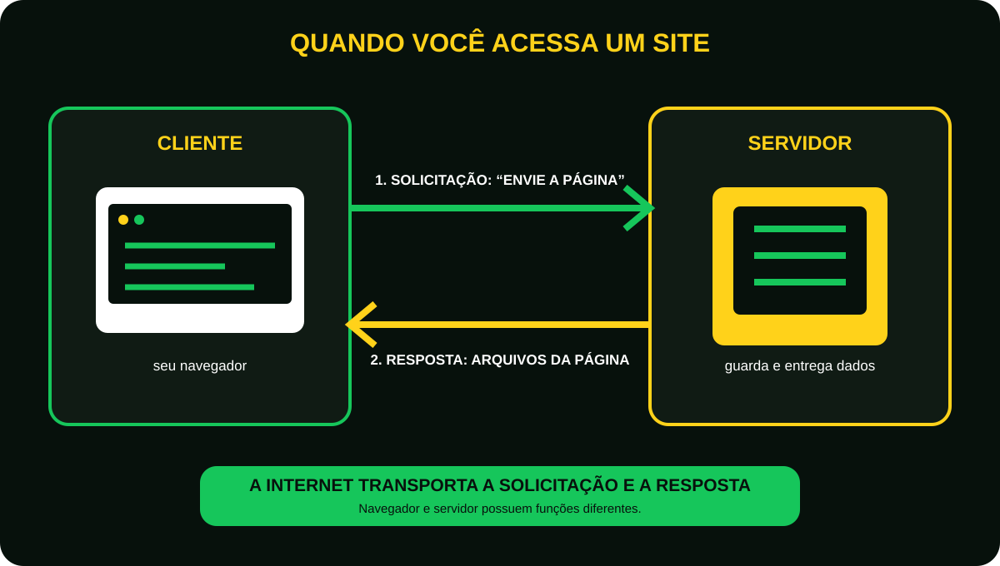
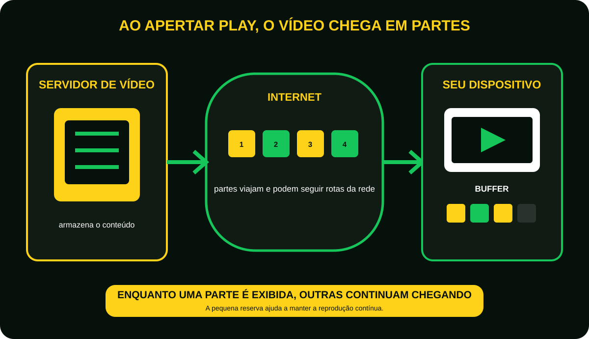

# Aula 9 - Como a internet funciona? A maior rede do mundo 
Imagine que agora mesmo você envie uma mensagem para um amigo.  
Você toca em:
**Enviar**
Menos de um segundo depois…  
Seu amigo recebe a mensagem.  
Mas existe uma pergunta interessante.  

## Como essa mensagem saiu do seu celular e chegou exatamente ao celular dele?
Ela atravessou:

- Sua casa;
- Seu bairro;
- Sua cidade;
- Seu estado.

Talvez até outro país.  
Tudo isso em menos de um segundo.  
Como isso é possível?  

## Imagine o Mundo como uma cidade gigante
Imagine uma cidade.  
Nela existem:

- Casas;
- Ruas;
- Avenidas;
- Rodovias.

Agora substitua.  
Casas = Computadores.  
Ruas = Cabos e Wi-FI.  
Rodovias = Grandes redes de internet.   
A internet funciona exatamente assim.  
É uma enorme rede conectando milhões de equipamentos.  

## O que é a internet?

A Internet é uma gigantesca rede que conecta dispositivos pelo mundo.  
Ela conecta:

- Computadores;
- Celulares;
- Tablets;
- Smart TVs;
- Videogames;
- Servidores;
- Câmeras;
- Dispositivos inteligentes.

**Todos conseguem conversar entre si.**

<figure class="sev-learning-figure">
  <picture>
    <source media="(max-width: 700px)" srcset="../../assets/aulas/modulo-1/aula-9/rede-de-redes-mobile.svg">
    
  </picture>
  <figcaption>A internet não é uma máquina central: é o resultado de muitas redes que se conectam e trocam dados.</figcaption>
</figure>

## Quem faz essa comunicação acontecer?
Imagine que você mora em um condomínio.  
Antes de uma carta chegar ao destino ela passa por vários locais.  
No mundo digital acontece o mesmo!  
Sua mensagem passa por vários equipamentos antes de chegar ao destino.  

## O caminho de uma mensagem

Imagine que você envie: ”Bom dia”, pelo WhatsApp.  
Veja o caminho:  
**Você > Celular > Wi-Fi > Roteador > Provedor de internet > Diversos equipamentos da internet > Servidor do whatsApp > Provedor do seu amigo > Roteador > Celular dele > Mensagem entregue**

Tudo isso normalmente acontece em menos de um segundo.  

<figure class="sev-learning-figure">
  <picture>
    <source media="(max-width: 700px)" srcset="../../assets/aulas/modulo-1/aula-9/caminho-da-mensagem-mobile.svg">
    
  </picture>
  <figcaption>O servidor do serviço recebe a mensagem e participa de sua entrega; o percurso real pode envolver muitos outros equipamentos.</figcaption>
</figure>

## O que é um provedor?
O provedor é a empresa que conecta sua casa à internet.  
Sem ele, seu computador ficaria isolado.  
Alguns exemplos conhecidos no Brasil oferecem acesso residencial, empresarial e móvel.  
O importante é entender sua função.  
**Conectar você ao restante da Internet.**

## O que é um roteador? 
O roteador é como um distribuidor.   
Ele recebe a Internet, depois distribui essa conexão para:

- Notebook
- Celular 
- Smart TV
- Videogame

Se você possui Wi-Fi em casa, existe um roteador trabalhando para você.

<figure class="sev-learning-figure">
  <picture>
    <source media="(max-width: 700px)" srcset="../../assets/aulas/modulo-1/aula-9/roteador-e-provedor-mobile.svg">
    
  </picture>
  <figcaption>O roteador atende a rede local; o provedor oferece o caminho de acesso às demais redes da internet.</figcaption>
</figure>

## O que é um servidor?
Imagine uma biblioteca.  
Todos os livros ficam guardados nela.  
Agora imagine um site.  
As informações também precisam ficar armazenadas em algum lugar.  
Esse lugar é o servidor!  
Quando você acessa um site, seu computador está pedindo informações para um servidor. 

<figure class="sev-learning-figure">
  <picture>
    <source media="(max-width: 700px)" srcset="../../assets/aulas/modulo-1/aula-9/cliente-e-servidor-mobile.svg">
    
  </picture>
  <figcaption>Cliente e servidor têm papéis diferentes: um solicita dados e o outro processa a solicitação e responde.</figcaption>
</figure>

## Um exemplo do dia a dia 
Você abre o YouTube. 
Mas os vídeos não estão no seu computador, eles estão armazenados em servidores.  
Quando você aperta “Play”, o vídeo começa a viajar pela Internet até chegar ao seu dispositivo.  
É como se o servidor estivesse enviando milhares de pequenos pedaços do vídeo continuamente.  

<figure class="sev-learning-figure">
  <picture>
    <source media="(max-width: 700px)" srcset="../../assets/aulas/modulo-1/aula-9/video-em-partes-mobile.svg">
    
  </picture>
  <figcaption>Enquanto uma parte do vídeo é reproduzida, outras continuam chegando e podem ficar temporariamente no buffer.</figcaption>
</figure>

## A Internet nunca dorme
Milhões de pessoas utilizam a Internet ao mesmo tempo.
A cada segundo acontecem:

- Mensagens; 
- Compras;
- Transferência bancárias; 
- Reuniões; 
- Jogos;
- Pesquisas;
- Vídeos.

Tudo isso porque milhões de computadores trabalham juntos.

## Curiosidade
Grande parte da infraestrutura da Internet utiliza servidores baseados em Linux.  
Mesmo quem nunca utilizou Linux em casa provavelmente acessa servidores Linux todos os dias sem perceber.
